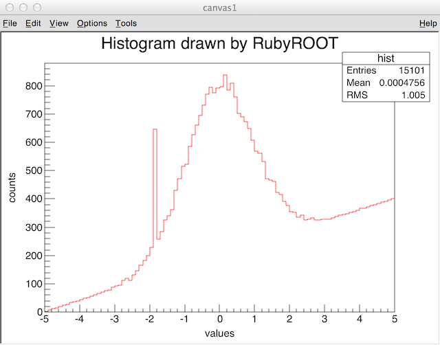
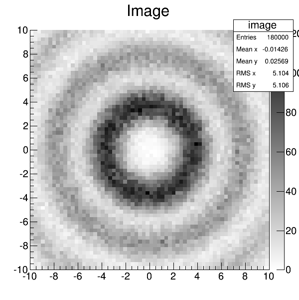
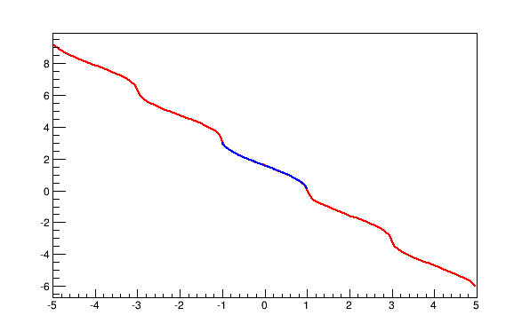

RubyROOT
========================================

Ruby binding of ROOT (CERN)

- Version: 0.1.8
- Author: Hirokazu Odaka


Introduction
----------------------------------------

RubyROOT is a Ruby binding of [ROOT](http://root.cern.ch/), which is a data
analysis framework developed by CERN. RubyROOT provides a minimun set of Ruby
interface to useful ROOT classes including histograms, trees, graphs, and
canvases. By using this extension library, we get a powerful data analysis
environment based on the flexibility of Ruby.

ROOT already has a well-designed Ruby binding, "RubyRoot", in the package. But
this seems not possible to be built with Ruby 2.0. Thus, we have started
developing of this library.

Currently, this Ruby wapper offers the following ROOT classes:  
TApplication, TArrow, TAttAxis, TAttFill, TAttLine, TAttMarker, TAttPad, TAttText,
TAxis, TBox, TBranch, TCanvas, TChain, TCollection, TColor, TDirectory,
TDirectoryFile, TEllipse, TF1, TFile, TFormula, TGraph, TGraphAsymmErrors,
TGraphErrors, TH1, TH1C, TH1D, TH1F, TH1I, TH1S, TH2, TH2C, TH2D, TH2F, TH2I,
TH2S, TH3, TH3C, TH3D, TH3F, TH3I, TH3S, TKey, TLeaf, TLegend, TLine, TList, TNamed,
TObjArray, TObjString, TObject, TPad, TROOT, TRandom, TRandom3, TSeqCollection,
TString, TStyle, TTree, TVirtualPad.

### Contact

- Hirokazu Odaka 
- ISAS/JAXA
- odaka(AT)astro.isas.jaxa.jp

### GitHub

https://github.com/odakahirokazu/RubyROOT/

### Supported Platform

- Mac OS X
- (Linux: not tested)

#### Note for Linux users

It should be possible to install RubyROOT on Linux though we have not tested
yet. You need to install the same software descibed below and then please try
the same way. It might be necessary to modify CMake files in this package.

#### Test environment

The author's developing/testing environment is as follows:

- MacBook Pro
- OS X Mavericks (10.9.4)
- Apple LLVM version 5.1 (clang-503.0.40) (based on LLVM 3.4svn)
- Homebrew
- ruby 2.0.0p481 (2014-05-08 revision 45883)
- ROOT 5.34/19

### Contributions Are Welcome

Contributions of any kind including documentation, testing, and coding are very
welcome.

### Licence

RubyROOT is distributed under the GNU General Public License version 3.


Installation
----------------------------------------

### Required Software

#### (1) C++ compliler

#### (2) [CMake](http://www.cmake.org/)
*version 2.8.11 or later*

This package uses CMake (Cross platform make) for easy installation.

#### (3) [Ruby](http://www.ruby-lang.org/en/)
*version 2.0.0*

Ruby 2.0 is required.

#### (4) [SWIG](http://www.swig.org/)
*version 2.0.9 or later*

SWIG (Simplified Wrapper and Interface Generator) provides an easy way to
generate extended libraries of various scripting languages.

#### (5) [ROOT](http://root.cern.ch/)
*version 5.34/19 or later*

A data analysis framework.


### Installation Guide

On Mac OS X with [Homebrew](http://mxcl.github.io/homebrew/), the easiest way
is as follows.

#### (1) Update Homebrew.

    $ brew update

#### (2) Install required software via Homebrew.

    $ brew install cmake
    $ brew install swig

#### (3) Check your Ruby version, or install Ruby.

You can check your Ruby verion by `ruby -v`. OS X Mavericks (10.9) includes
Ruby 2.0.0-p247, so you do not need to install a new version of Ruby. Go to
Step (4).

If you are using an older version, or you want to use a specific version of
Ruby, we recommend using rbenv. [Rbenv](https://github.com/sstephenson/rbenv/)
provides nice Ruby environemt, in which you can easily/safely choose different
Ruby versions. It can easily introduced using Homebrew on OS X.

    $ brew install ruby-build
    $ brew install rbenv

To initialize rbenv, write the following line in *.bashrc* or *.zshrc*.

    eval "$(rbenv init -)"

Then, in a new shell, install Ruby as follows.

    $ rbenv install -l

This will show like this => 

    Available versions:
      1.8.6-p383
      1.8.6-p420
      1.8.7-p249
      ...
      2.0.0-p353
      2.0.0-p451
      2.0.0-p481
      2.0.0-preview1
      ...

Then, select the latest stable version: 2.0.0-p481, for example.

    $ rbenv install 2.0.0-p481
    $ rbenv rehash
    $ rbenv global 2.0.0-p481

#### (4) Install ROOT.

    $ brew install root

#### (5) Obtain RubyROOT via GitHub.

    $ git clone git://github.com/odakahirokazu/RubyROOT.git

#### (6) Build & install.

    $ ls
      RubyROOT ...
    
    $ mkdir RubyROOT-build
    $ cd RubyROOT-build
    $ cmake ../RubyROOT -DCMAKE_INSTALL_PREFIX=<your_install_destination>

By default, `CMAKE_INSTALL_PREFIX` is set to `$HOME`; the ruby extention
library will be installed in `$HOME/lib/ruby`.

    $ make
    $ make install

#### (7) Set environment variable.

Write the following line in *.bashrc* or *.zshrc*.

    export RUBYLIB=<your_install_destination>/lib/ruby:$RUBYLIB


Usage
----------------------------------------

### Getting Started: Histogram and File

The first example is to handle a histogram and a file. You can get a script
example from [examples/write_hist.rb](./examples/write_hist.rb).

```ruby
require 'RubyROOT'

Root::TFile.open('hist.root', 'RECREATE') do
  h = Root::TH1D.create('hist', 'Histogram', 100, -5.0, 5.0)
  1.upto(h.GetNbinsX){|i| h.SetBinContent(i, i*4.0) }
  h.SetBinContent(32, 547.2)
  h.FillRandom("gaus", 15000)
  h.Write
end
```

This script makes a histogram named "hist" with 100 bins in a range from -5.0
to +5.0. Then, certain values are assiend. It also fill 15000 values sampled
from a Gaussian distribution with sigma=1. Finally, the created histogram is
saved to a new file called "hist.root".

A Ruby script using ROOT needs to require *RubyROOT.rb*. Most of classes and
methods are members of *Root* module, so you can use a ROOT class with the
module name like `Root::TFile`. You can also *include* the module in order to
access the ROOT classes without specifying the module name explicitly.

```ruby
include Root
h = TH1D.create('hist', 'Histogram', 100, -5.0, 5.0)
```

#### ROOT file

To open a ROOT file, you can use `TFile.open(file_name, option)`. Without a
block, this method returns a file object opened. If a block is given to the
method like the above example, the file obejct is passed as a block variable
and can be used in the block. After the block process, the file is
automatically closed by calling `TFile.Close()`. In this case, *open* method
returns *nil*. The next two code have the same effect.

##### openning file without a block
```ruby
f = TFile.open('data.root')
# do something
f.Close
```

##### openning file with a block
```ruby
TFile.open('data.root') do |f|
  # do something
end
```

#### Making a histogram

Histograms are frequently used data in our analysis. To make a histogram, you
can use *create* methods like

```ruby
h = TH1D.create(name, title, number_of_bins, lower_edge, upper_edge)
```

This has the same effect as C++ code below:

```c++
TH1* h = new TH1D(name, title, number_of_bins, lower_edge, upper_edge);
```

Although Ruby classes normally have *new* method to allocate a new object, you
should use *create* method to make a new histogram object.

The histogram created by RubyROOT can be handled by the same way as C++
functions:

```ruby
h.Fill(value)
h.Fill(value, weight)
h.SetBinContent(bin, counts)
value = h.GetBinContent(bin)
```

To write the histogram to the file, you can use `TH1#Write()` or
`TFile#Write()`. If you need to change the ownership of the object, you can use
`TH1#SetDirectory(directory)`.

```ruby
h.SetDirectory(f)
h.Write
```

##### About *create* method for experts

In fact, it is possible to call *new* methods to make a histogram as
`TH1D.new`, but this causes a conflict between Ruby's garbage collection and
memory management by ROOT.

#### Reading a histogram in a file

Now you have gotten a file *hist.root* containing a histogram after execution
of *write_hist.rb*. The second example script
[examples/read_hist.rb](./examples/read_hist.rb) tells us how to read this
file.

```ruby
Root::TFile.open('hist.root') do |f|
  h = f.Get('hist')
  for i in 1..h.GetNbinsX
    puts "%4d %6.1f" % [i, h.GetBinContent(i)]
  end
end
```

This simple script opens *hist.root* and gets the histogram object *hist* by
calling `TFile#Get()` method. Then, it dumps the bin labels and value contents
of all bins. You will get this:

       1    4.0
       2    8.0
       3   12.0
    ...
      49  774.0
      50  791.0
      51  798.0
    ...
      98  392.0
      99  396.0
     100  400.0

#### Drawing a histogram

See [examples/draw_hist.rb](./examples/draw_hist.rb) as an example to draw a
histogram. To draw something in a canvas, you need to include *RootApp* module.
A canvas should also be created by `TCanvas.create(name, title, width, height)`
method. After invoking `TH1#Draw()` and `TCanvas#Update()`, call `run_app()` to
run ROOT TApplication. **Please note that to quit the application properly, you
need to select "Quit ROOT" from the pulldown menu "File".** If you closed the
canvas window by pushing the close button, the application would be still
running. In this case, you can quit the application via Ruby application or
*kill* command in the shell.

```ruby
#!/usr/bin/env ruby

require 'RubyROOT'
include RootApp

Root::TFile.open('hist.root') do |f|
  c1 = Root::TCanvas.create("c1", "canvas1", 640, 480)
  h = f.Get('hist')
  h.Draw
  h.SetLineColor(2)
  h.GetXaxis.SetTitle("values")
  h.GetXaxis.SetTitleOffset(1.2)
  h.GetXaxis.CenterTitle
  h.GetYaxis.SetTitle("counts")
  h.GetYaxis.CenterTitle
  h.GetYaxis.SetTitleOffset(1.35)
  h.SetTitle("Histogram drawn by RubyROOT")
  c1.Update
  run_app
end
```

This script will draw a histogram like this.



#### 2D and 3D histograms

RubyROOT supports 1D, 2D and 3D histograms (TH1, TH1C, TH1D, TH1F, TH1I, TH1S,
TH2, TH2C, TH2D, TH2F, TH2I, TH2S, TH3, TH3C, TH3D, TH3F, TH3I, TH3S). See
[examples/hist2d.rb](./examples/hist2d.rb).



### Tree

A tree is also useful data structure provided in ROOT, which is very similar to
a table. Usage of the TTree class in the normal C++ mode is a little bit
complicated compared with histograms. In RubyROOT, API is redesigned to fit the
Ruby language.

#### Writing a tree

Let's see a script [examples/write_tree.rb](./examples/write_tree.rb). This
creates a tree (i.e. table) with value columns of *event_id*, *position*, and
*energy*, and then save it to a file.

```ruby
random = Root::TRandom3.new

Root::TFile.open("tree.root", "RECREATE") do
  tree = Root::TTree.create("tree", "tree")
  row = tree.define(event_id: 'I', position: 'F', energy: 'F')
  1000.times do |i|
    row.event_id = i+1
    row.position = random.Uniform(-12.8, +12.8)
    row.energy = random.Gaus(511.0, 2.5)
    tree.Fill
  end
  tree.GetEntries.times{|i| tree.Show i }
  tree.Write
end
```

A tree object is also generated by calling `TTree.create()` like a histogram.
To define branches, you can use `TTree#define()` with keyword arguments that
specify pairs of the name and type of branches.

```ruby
row = tree.define(event_id: 'I', position: 'F', energy: 'F')
```

This defines three branches (or columns):

- event_id (type: signed 4-byte integer),
- position (type: single-precision floating point), and
- energy (type: single-precision floating point).

A character specifying a type is the same as ROOT's definition (e.g. 'D' for
double-precision floating point, 's' for unsigned 2-byte (short) integer.)
This method returns a buffer object that contains the branch (column) data for
an entry (a single row). You can assign a value to the data buffer as
`row.energy = value` and call `TTree#Fill()` to fill the data into the tree.

#### Reading a tree

RubyROOT also provides an easy way to read a tree as shown in
[examples/read_tree.rb](./examples/read_tree.rb).

```ruby
Root::TFile.open("tree.root") do |f|
  tree = f.Get("tree")
  tree.read.each do |t|
    puts "%4d  %7.2f  %7.2f" % [t.event_id, t.position, t.energy]
  end
end
```

The tree saved in a file can be obtained by `TFile#Get()`. `TTree#read()`
returns an *enumerable* object that scans all entires (rows), so `each` method
with a block can be accessible to the contents of each entry via the branch
name like `t.energy`.

### Graph

Making a graph is easy. See [examples/graph.rb](./examples/graph.rb).
A TGraph object is created by `TGraph.create(x_values, y_values)`.

```ruby
require 'RubyROOT'
include RootApp

### data definition
x = [1.0, 2.3, 3.1, 4.0, 5.0]
y = [1.2, 2.1, 10.2, 3.2, 4.0]

### make a graph and draw it
graph = Root::TGraph.create(x, y)
graph.SetName("graph1")
c1 = Root::TCanvas.create
graph.Draw("APL")
c1.Update
run_app
```

RubyROOT also provides *TGraphErrors* and *TGraphAsymmErrors*.
See [examples/graph_with_error_bars.rb](./examples/graph_with_error_bars.rb)
and [examples/graph_with_asymmetric_error_bars.rb](./examples/graph_with_asymmetric_error_bars.rb).
All arguments are given as *Array*.

```ruby
graph1 = TGraphErrors.create(x_values, y_values, x_errors, y_errors)
graph2 = TGraphAsymmErrors.create(x_values, y_values, x_lower_errors, x_upper_errors, y_lower_errors, y_upper_errors)
```

To write a graph into a file, the graph object must have a name.
See [write_graph.rb](./examples/write_graph.rb).

```ruby
graph = Root::TGraphErrors.create(x, y, xe, ye)
graph.SetName("graph1")
```

### Functions

Class *TF1* is used for a mathematical function.
See [function.rb](./examples/function.rb).
This script makes a TF1 object that represents a function *f(x)=(x-1)^2-2*.
This class allows us to use *new* method to create an object. Then, the
function is evaluated at three x-values, 0.0, 1.0, and 2.0. To draw it, just
call `TF1#Draw()` method.

```ruby
f = Root::TF1.new("func", "(x-1)^2-2", -3.0, +4.0)
puts "f(x)=#{f.Eval(0.0)} for x=0.0"
puts "f(x)=#{f.Eval(1.0)} for x=1.0"
puts "f(x)=#{f.Eval(2.0)} for x=2.0"
f.Draw
```

#### Function defined in Ruby code

You can also define a function in a Ruby code session.
[function_in_ruby.rb](./examples/function_in_ruby.rb) tells us how
to do it. You can use a function object generator `Root::func` which accepts
a block returning a user-defined function value of a given argument *x*.

```ruby
acos_extended = Root::func{|x|
  n = ((x+1.0)/2.0)
  cycle = (n>0.0) ? n.to_i : -(n.abs.to_i)-1
  Math::acos(x-cycle*2.0)-Math::PI*cycle
}

f = Root::TF1.create("func", acos_extended, -5.0, 5.0, 1)
```

The block given to `Root::func` describes an arbitray user-defined function. In
this example, we try to define an extended version of *arccos(x)* that has a
limitless domain of definition while normal *arcsos(x)* accepts a value ranging
from -1 to +1. As shown below, the function is extended to outside of [-1, 1].
The normal version of *acos(x)* created by `TF1.new` is superposed in blue
color.



##### Comments for experts

The function object generator `Root::func` is defined in *RubyROOT.rb* as

```ruby
def func(&f)
  lambda {|x, p| f.(x[0]) }
end
```

So you can define the function obejct by directly using `lambda`.
You can find it in [function_in_ruby2.rb](./examples/function_in_ruby2.rb).

```ruby
acos_extended = lambda{|xs, ps|
  x = xs[0]
  n = ((x+1.0)/2.0)
  cycle = (n>0.0) ? n.to_i : -(n.abs.to_i)-1
  Math::acos(x-cycle*2.0)-Math::PI*cycle
}
```


Frequently Asked Questions
----------------------------------------

### Installation

#### I failed to install Ruby via rbenv.

Try the latest versions of rbenv and ruby-build you can obtain via homebrew.

For version 2.0.0-p451, I needed to set RUBY_CONFIGURE_OPTS like this:

    RUBY_CONFIGURE_OPTS="--with-readline-dir=/usr/local" rbenv install 2.0.0-p451

This workaround forces ruby-build to use readline provided by OS X system,
which is actually libedit (readline compatible library).
This problem seems to be resolved in version 2.0.0-p481.

### Data Analysis using RubyROOT

#### When should I use *create* method insted of *new* method?

You should use *create* when you make a histogram, tree, canvas, or graph.
These *create* methods are provided if default *new* methods cause some
problems within the Ruby environment or have incovenient API as Ruby interface.
To make a histogram or tree object, you should use *create* method in order to
avoid a conflict with Ruby's garbage collection. In the case of graphs,
*create* method makes a graph objects directly from Ruby native Array while
*new* method can be used for making a graph only from C++-based DoubleArray.

#### Can I use a tree including a variable-length array?

Yes, you can. See
[examples/write_tree_variable_length.rb](./examples/write_tree_variable_length.rb)
and
[examples/read_tree_variable_length.rb](./examples/read_tree_variable_length.rb).

#### How can I get a parameter and error value of the mizimization result?

You can use methods below:
- Minuit2FunctionMinimizer#GetParameter(index)
- Minuit2FunctionMinimizer#GetError(index)

See also [examples/minimization.rb](./examples/minimization.rb).

#### Can I use color constants defined in ROOT?

Yes. But they are renamed in order to obey a Ruby grammar that the first
character of a constant is capital. You can use:
KWhite, KBlack, KGray, KRed, KGreen, KBlue, KYellow, KMagenta, KCyan,
KOrange, KSpring, KTeal, KAzure, KViolet, KPink.

****************************************
